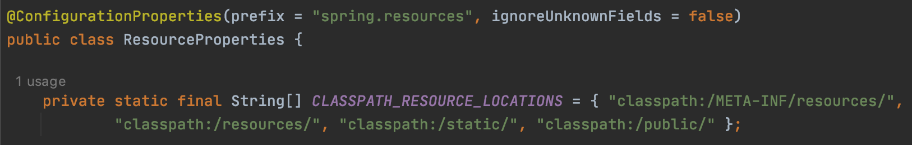

# 스프링부트의 스프링MVC

### WebMvcAutoConfiguration
- 스프링부트에서 DispatcherServlet 관련 각종 빈들을 등록해주는 곳.  
- ResourceProperties도 생성하여 application.properties 설정파일을 읽어서 빈들을 만들 때 사용한다.  
- BeanFactory 타입의 모든 빈들을 등록해준다.  

### resourceHandlerMapping
- 리소스 관련 핸들러. 
- /resources/static 정적 리소스를 지원하는 기능. (이외 다른 디렉토리들도 지원.) 
- resourceHandlerMapping를 설정하면 캐싱 관련 정보들이 응답 헤더에 추가로 추가됨. 
- 요청의 캐시 정보로 적절한 응답을 보낼 수 있음.  
- 예를 들어, 리소스가 변경되지 않았으면 not modified(304)라는 응답으로 보내서  
    브라우저가 캐싱하고 있는 리소스를 그대로 사용하도록 함.  

### RequestMappingHandlerAdapter
- 애노테이션 기반의 핸들러매핑을 처리할 수 있는 어댑터. 

### ContentNegotiatingViewResolver
- 본인이 직접 뷰를 처리하는게 아니라 다른 ViewResolver들에게 일 처리를 위임함. 
- ContentNegotiatingViewResolver가 가지고 있는 viewResolvers 프로퍼티가 
    다른 4개의 뷰리졸버들을 참조하고 있음.  
    때문에 뷰리졸버 중에 우선순위가 항상 최상위.   

### spring.factories
- /spring-boot-autoconfigure-2.3.4.RELEASE.jar!/META-INF/spring.factories 
- 서비스 로케이트 패턴과 비슷함.  
- 'org.springframework.boot.autoconfigure.EnableAutoConfiguration='에 해당하는 
    모든 자동설정 파일들이 조건에 따라 적용이 됨.  
- DispatcherServletAutoConfiguration은 DispatcherServlet 자동설정. 
- DispatcherServlet을 만드는 코드가 담겨있다.  
- ServletWebServerFactoryAutoConfiguration은 톰캣 관련 자동설정.  
- WebMvcAutoConfiguration은 스프링 웹 MVC 자동설정.  

### 스프링부트 애플리케이션 타입 3가지
- Servlet(Web), WebFlux(Web), Non web   

### @ConditionalOnClass({ ... })
- @ConditionalOnClass에 설정된 클래스가 클래스패스에 있는 경우 사용하라는 의미.   

### @ConditionalOnMissingBean({ ... })
- @ConditionalOnMissingBean에 설정된 클래스 타입의 빈이 없는 경우 사용하라는 의미.  
- 예를 들어,  
    WebMvcAutoConfiguration에는 @ConditionalOnMissingBean({WebMvcConfigurationSupport.class})이 
    설정되어 있는데, WebMvcConfigurationSupport에 해당하는 빈이 없어야만 사용한다는 의미이다.  
    @EnableWebMvc가 임포트하는 DelegatingWebMvcConfiguration이 WebMvcConfigurationSupport를 상속받고 있다.  
    @EnableWebMvc는 스프링부트를 사용하지 않을 때 사용한다.  
    현재 프로젝트는 스프링부트를 사용하므로 이 빈이 없을 때에 사용한다는 의미이다.  
    만약 스프링부트에서 제공하는 웹 MVC 설정을 사용하지 않고 스프링 웹 MVC를 설정하고자 할 경우에는 @EnableWebMvc를 붙이면 
    @EnableWebMvc가 임포트하는 DelegatingWebMvcConfiguration이 WebMvcConfigurationSupport를 상속받고 있기 때문에 
    WebMvcConfigurationSupport 타입이 빈으로 등록이 되고 스프링부트의 웹 MVC 설정인 WebMvcAutoConfiguration의 
    @ConditionalOnMissingBean({WebMvcConfigurationSupport.class}) 설정에 위배되기 때문에 
    스프링부트에서 제공하는 스프링 웹 MVC 설정을 사용하지 않게 된다.  

### ResourceProperties
 
- CLASSPATH_RESOURCE_LOCATIONS에 리소스 관련 경로가 들어있다. 
- '@ConfigurationProperties(prefix = "spring.resources" ...'이라고 되어있는 부분은 
    application.properties에서 prefix로 앞에 'spring.resources'가 붙은 속성을 들고 온다는 의미.  

### ThymeleafAutoConfiguration
- 스프링부트 spring.factories에 포함되어 있는 타임리프 기본 설정.  
- 타임리프에서 제공하는 뷰리졸버인 thymeleafViewResolver가 빈으로 등록되어 있는 것을 확인할 수 있다. 
- ThymeleafProperties 프로퍼티즈를 사용하며, 
    @ConfigurationProperties(prefix = "spring.thymeleaf")로 
    프로퍼티즈 파일에서 prefix로 앞에 'spring.thymeleaf'가 붙은 속성을 불러와서 사용하는 것을 알 수 있다.  
- application.properties 파일에서 'spring.thymeleaf'를 치고 자동완성 목록을 보면 
    아래처럼 prefix와 suffix에 기본값이 설정되어 있는 것을 확인할 수 있다. 
<pre>
spring.thymeleaf.prefix=classpath:/templates/
spring.thymeleaf.suffix=.html
</pre>

  

## 스프링 MVC 커스터마이징
- application.properties (가장 많이 손을 안대고 설정할 수 있는 방법.)
- @Configuration + Implements WebMvcConfigurer 
    : 스프링부트의 스프링MVC 자동설정 + 추가 설정
- @Configuration + **_@EnableWebMvc_** + Implements WebMvcConfigurer 
    : 스프링부트의 스프링MVC 자동설정 사용하지 않음.
    
### @Configuration + Implements WebMvcConfigurer
- 스프링부트에서 제공하는 스프링MVC 기존 설정 그대로 유지하면서 추가만 하는 것.  
    
  

